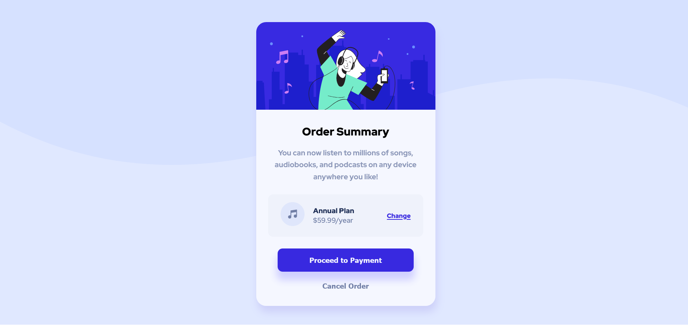

# Frontend Mentor - Order summary card solution

This is a solution to the [Order summary card challenge on Frontend Mentor](https://www.frontendmentor.io/challenges/order-summary-component-QlPmajDUj). 

## Table of contents

- [Overview](#overview)
  - [The challenge](#the-challenge)
  - [Screenshot](#screenshot)
  - [Links](#links)
- [My process](#my-process)
  - [Built with](#built-with)
  - [What I learned](#what-i-learned)
  - [Continued development](#continued-development)
  - [Useful resources](#useful-resources)
- [Author](#author)
- [Acknowledgments](#acknowledgments)

## Overview

### The challenge

Users should be able to:

- See hover states for interactive elements

### Screenshot




### Links

- Solution URL: [Add solution URL here](https://your-solution-url.com)
- Live Site URL: [Add live site URL here](https://your-live-site-url.com)

## My process

### Built with

- HTML markup and plain CSS
- Google Fonts
- CSS variables
- Flexbox
- Mobile-first workflow

### What I learned

In this project I applied basic HTML and CSS concepts. The following snippets represent the principal topics learned and used:

How to add Google fonts to HTML document:
```html
<link rel="preconnect" href="https://fonts.googleapis.com" />
    <link rel="preconnect" href="https://fonts.gstatic.com" crossorigin />
    <link
      href="https://fonts.googleapis.com/css2?family=Red+Hat+Display:wght@500;700;900&display=swap"
      rel="stylesheet"
    />
```
How to change opacity in hover state:
```css
.proceed-payment:hover {
  opacity: 0.5;
}
```
How to align elements with Flexbox:
```css
.payment {
  display: flex;
  flex-wrap: wrap;
  align-items: center;
  justify-content: center;
}
```
How to add a background image to design based on screen size:
```css
@media (min-width:640px) {
  body {
    background-image: url("images/pattern-background-desktop.svg");
    background-repeat: no-repeat;
  }
  .card {
    margin-top: 150px;
  }
}
```

### Continued development

In the next projects I will continue using key concepts of HTML5 and CSS3. Also, my goal is to use a CSS framework like [TailwindCSS](https://tailwindcss.com/) and a new frontend development environment known as [Vite](https://vitejs.dev/).

### Useful resources

- [Fit images to container](https://developer.mozilla.org/es/docs/Web/CSS/object-fit) - The object-fit CSS property sets how the content of a replaced element, such as an  or <video>, should be resized to fit its container.

## Author

- Website - [Gustavo Sanchez](https://www.gusanche.dev)
- Frontend Mentor - [@gusanchedev](https://www.frontendmentor.io/profile/gusanchedev)
- Github - [@gusanchedev](https://www.github.com/gusanchedev)
- Twitter - [@gusanchedev](https://www.twitter.com/gusanchedev)
- Linkedin - [gusanchedev](https://www.linkedin.com/in/gusanchedev/)

## Acknowledgments

Thanks to Mariapaz for being my friend and support 💙
